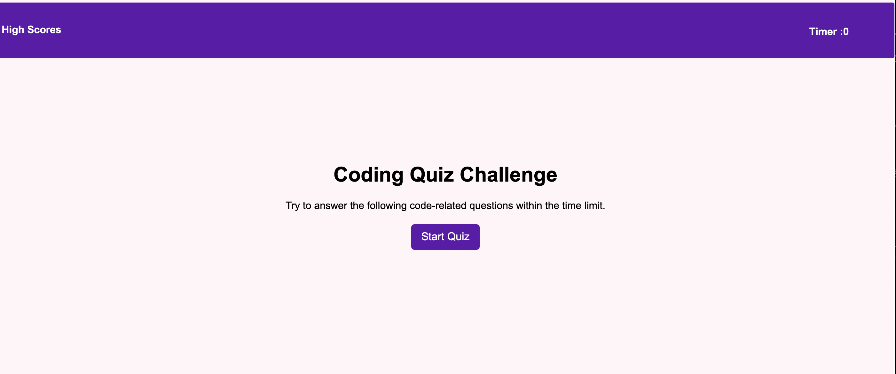
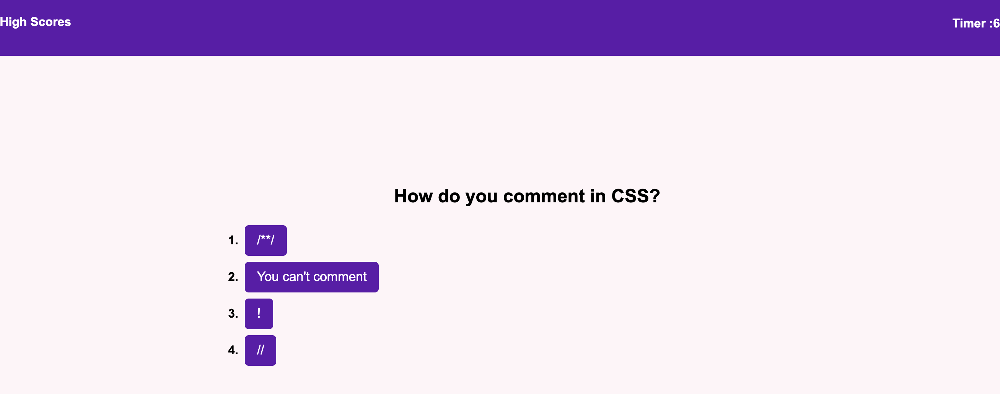

# Quiz-creater

Designed by Maria Villarreal

 

## Getting Started
You may use this app by clicking on the github link below. 
- //msvillarreal21.github.io/quiz-creater/

## Prerequisites 
You will need a code editing software to be able to download and save this code. VS code was used to create this app. 

## Summary 
This app sets up multiple questions to be answered by the user. The user is timed and each correct answer gives them point. At the end of the quiz the user may save their high scores and view the high scores of other users.  

## File types:
- Html : to link javascript and holds basic infomation for browser to display

- Css : to design the page.

- Javascript- to run the app. 